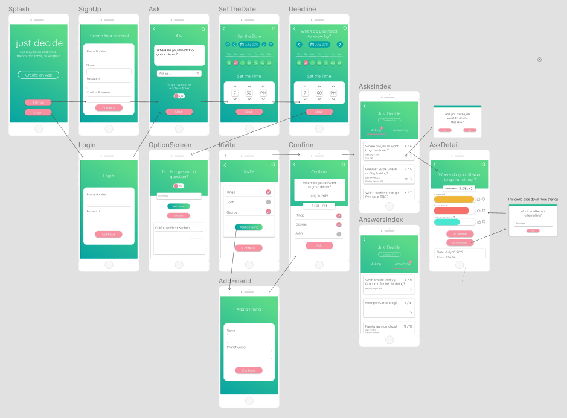
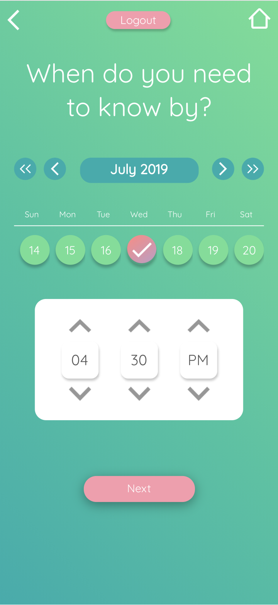
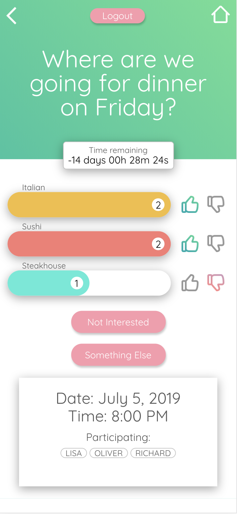

# JustDecide
JustDecide is an app which helps a group of people come to a decision on a shared endeavor. Pose a question, set a deadline, invite a group of friends or family to take part, and they can all weigh in. Not only can they vote on existing options, but they can also offer new suggestions. When time runs out, a decison has been made! 

https://justdecide.herokuapp.com/#/

Technologies used are MongoDB, Express, React, NodeJS, GraphQL and Apollo.
To optimize the app's primary use case, it is important that a user can access it on their phone.  For that reason, Just Decide is built with a mobile-first design. 

</br>
</br>

<p align="center">
    
</p>

</br>
</br>


### Key Features:

1. User Authentication:
    * User can:
      * Sign Up
      * Login
      * Logout
  
    * A user must be logged in to create or view an Ask, as well as vote. 
    
2. Ask:
    * Create an Ask with a description, "Asking as" name, and indicate whether or not the Ask has a date.
      * User can create a yes/no question, which will pre-populate the options list.
      * User can input their own options.
      * Calendar to set a deadline and/or a date for the Ask.
    
    * View all Asks or asks you are Answering on the Index page. 
    * Delete an Ask from the Index page.
    * Ask Detail:
      * Shows details of the Ask: question, date, participating members.
      * A timer component counting down to the deadline date.
      * Option for a user to opt out.
      * Option for a user to suggest a different option.
      
3. Invite to participate:
    * List will pre-populate with a list of existing contacts that can be selected.
    * User can add a new contact by inputting their name and phone number.
    * An invite with a url will be sent via SMS.
    * A user can create groups that they can easily create Asks for.
    
4. Votes (Ask Detail screen):
    * Users can upvote or downvote an option.
    * Options are shown in a form of bar chart, with percentage of votes indicated by length of bar.
    
5. UX/UI:
    * Mobile-first design.
    * Custom weekly calendar with a highlighted cell indicating the selected date.
    * Use the JavaScript date libarary date-fns to implement the calendar.
    * Custom time picker.
    

#### Calendar and Deadline Screen

This screen allows users to set a date and time for their Ask or event, as well as a deadline by which the decision needs to be made. In terms of UI, this screen was the jumping off point from where the rest of the app design was born. As we were going with a mobile-first approach, it was important to us that the UI and was well thought-out and appropriate for mobile, while also being beautiful and functional.

The calendar and time picker components utilize the JavaScript date library date-fns. We opted to go with date-fns and not use Moment.js because date-fns is a lightweight libaray, and it’s simple and straight forward API made it a really easy to work with.
 
In order to display the calendar in a weekly view, it was necessary to calculate the start and end dates of the current month, as well as the current week, to make sure to display the correct dates and that they change accordingly. 
At the moment, the month that is displayed is reflective of the first day of the current week. In weeks that span 2 months, an optimization would be to calculate which month has a majority of the days and then display the month according to that. 

```
renderDates() {
    const { currentMonth, selectedDate } = this.state
    const monthStart = dateFns.startOfMonth(currentMonth)

    const currentWeekStart = this.state.currentWeekStart
    const currentWeekEnd = this.state.currentWeekEnd

    const dateFormat = 'D'
    const rows = []

    let days = []
    let day = currentWeekStart
    let formattedDate = ''

    while (day <= currentWeekEnd) {
      for (let i = 0; i < 7; i++) {
        formattedDate = dateFns.format(day, dateFormat)
        const cloneDay = day
        days.push(
          <div
            className="col cell"
            key={day}
            onClick={() =>
              this.onDateClick(dateFns.parse(cloneDay), currentWeekStart)
            }
          >
            <span
              className={`number ${
                !dateFns.isSameMonth(day, monthStart)
                  ? ' disabeled'
                  : dateFns.isSameDay(day, selectedDate)
                  ? 'selected'
                  : ''
              }`}
            >
              {formattedDate}
            </span>
          </div>
        )
        day = dateFns.addDays(day, 1)
      }
      rows.push(
        <div className="row" key={day}>
          {days}
        </div>
      )
      days = []
    }
    return <div className="body">{rows}</div>
  }
  ```
  </br>
  </br>
  
  <p align="center">
    
  </p>
  
  </br>
  </br>
  


#### Ask Detail Screen:
This screen shows all the details of the Ask: description, date, time, participants, options, and a timer which counts down to the deadline date. 
Participants are able to upvote or downvote options, and the current standing of each option is indicated by it’s progress bar. Users can also opt out of the event or Ask, as well as contribute their own idea or alternative option. 

The Ask Detail component was implemented with React State Hooks and the use of sibling components to display each major element of the AskDetail screen, allowing for cleaner and easily legible code.
The use of components also allowed for re-use of components, which DRYs out the overall codebase. For example, the countdown timer is it’s own component, which allowed it to be used in the Ask Confirm component as well as here in the Ask Detail component. 

The Options List component receives Ask details from it’s parent Ask Detail component, which provides option details   stored as part of the OptionType. The Options List uses this data to calculate the net vote count for each option, sets a length for the bar according to it’s standing amongst the other options, then sorts the bars in descending order.
It passes this information to the OptionBar component, which renders each option bar, along with the ‘thumbs up’ and ‘thumbs down’ buttons for voting. 
Each ThumbsUp and ThumbsDown elements are also their own components, which handle the mutation to the backend to update the Option vote count in the Option Type.

```
const OptionsList = ({ ask, history }) => {
  const barColors = ['ochre', 'pink', 'turquoise', 'plum']

  const { options, invitations } = ask

  const netVote = option => {
    return option.votes.reduce(
      (acc, vote) => acc + (vote.direction === 'up' ? 1 : 0),
      0
    )
  }

  const winningVotes = options.reduce((acc, option) => {
    const opt_vote = netVote(option)
    if (opt_vote > acc) return opt_vote
    return acc
  }, 0)

  const barPct = option => Math.max(netVote(option) / winningVotes, 0.15)

  const orderedOptions = options.sort((a, b) => barPct(b) - barPct(a))

  return (
    <div
      style={{
        paddingTop: 37,
        width: '100%'
      }}
    >
      {orderedOptions.map((option, idx) => (
        <OptionBar
          key={option.id}
          option={option}
          colorClass={barColors[idx % 4]}
          barPct={barPct(option)}
          history={history}
          invitations={invitations}
          ask_id={ask.id}
        />
      ))}
    </div>
  )
}
```

</br>  
</br>

<p align="center">
  
</p>

</br>
</br>


  #### Features to Implement:
  
   * Invite privileges
   * Karma points for good/winning choices
   * Invite via social media contact list
   * Avatar
